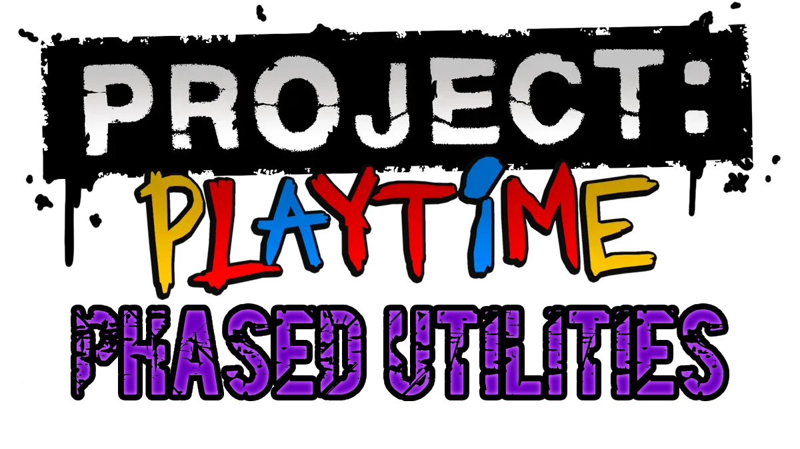

  

A mod that I made for Project: Playtime (Phase 3), which simply adds some small useful things that are always nice to have, without anything that changes the game or gameplay significantly. Post suggestions/feedback/bug reports in Issues!

## Explanation:
If there's a ◇ next to a feature, it means it will not work for other players at all and is purely client side.

If there's a ◈ next to a feature, it means it will work for other players as long as the host has the mod.

If there's a ◆ next to a feature, it means it will only work for the player using it, but will also be perfectly visible for all players.

Things after a | are the reasons/descriptions for the change.

## Current Features:
◆ **Better Comms Chat                                   | Makes the comms chat look a bit better.**

 ⌊ Player Chat Color (Blue >> Violet)

 ⌊ Unimportant Text Font Size (12 >> 10)

◇ **Re-Added Private Matches                            | Re-enables the normally disabled private match button, however it currently is not able to be used to play private matches from what I know.**

◇ **No Early Access Overlay                             | Removes that annoying early access overlay that sits at the bottom right of your screen, less UI clutter!**

◆ **Unlock All Cosmetics                                | This mod will also give you all cosmetics so your character can look cool! Unlike all phase 2 mods, this does include emotes, so this mod is a good way to get emotes in phase 2 as well by equipping them here and going back to phase 2.**

◈ **A Lot Of Tickets                                    | You will get a lot more tickets for a lot of actions that normally give a very little amount!**
 
 ⌊ Puzzles Completed   (20 Tickets >> 20K Tickets)
 
 ⌊ Players Revived     (10 Tickets >> 10K Tickets)
 
 ⌊ Players Extracted   (30 Tickets >> 30K Tickets)
 
 ⌊ Toy Parts Deposited (5 Tickets >> 5K Tickets)
 
 ⌊ Time Survived       (0 Tickets >> 10K Tickets)
 
 ⌊ Escaped On Train    (0 Tickets >> 50K Tickets)
 
 ⌊ Skillful Extraction (0 Tickets >> 300K Tickets)
 
 ⌊ Adept Extraction    (0 Tickets >> 200K Tickets)
 
 ⌊ Near Escape         (0 Tickets >> 100K Tickets)
 
 ⌊ Players Downed      (10 Tickets >> 10K Tickets)
 
 ⌊ Players Deposited   (20 Tickets >> 20K Tickets)
 
 ⌊ KillDCs             (0 Tickets >> 50K Tickets)
 
 ⌊ Toy Parts Remaining (0 Tickets >> 5K Tickets)

## How To Use:
**Mod Setup Files Link:** [Click Me!](https://files.catbox.moe/xq81v0.zip) | If this ever stops working, please let me know by creating an issue!
- Extract mod setup files
- Open mod unlocker folder
- Open application inisde and wait for it to update & stuff
- Open your Project: Playtime game files
- Navigate to Playtime_Multiplayer > Binaries > Win64
- Copy that file path
- Go to the mod unlocker and press the open button
- Paste in the file path and press select folder
- Click the patch button and confirm any popups
- Open the "the three files" folder in the mod setup files
- Open your Project: Playtime game files but without navigating anywhere
- Drag over the three files from the folder into your game files and click replace files in destination
- Extract my actual mod, open the folder inside, and you should see folders like: Items, Interface, etc.
- Open your Project: Playtime files and navigate to Playtime_Multiplayer > Content
- Drag over the mod files (Items, Interface, etc.) into that Content folder
- Inside of your Project: Playtime files without navigating anywhere, delete the EasyAnticheat folder

## How To Update:
- Get the new version you want to use
- Extract the new version of the mod, and look for a folder containing files like: Items, Interface, etc.
- Open your Project: Playtime game files
- Navigate to Playtime_Multiplayer > Content
- There is two methods of doing this: Risky, But Keep Other Mods, and Safe, But Remove Other Mods
  - **[SAFE, BUT REMOVE OTHER MODS]** In the Content folder, delete all of the old mod files (Do not delete IllusoryContent, Movies, Paks) and put all of these files (Items, Interface, etc.) into the Content folder you opened earlier
  - **[RISKY, BUT KEEP OTHER MODS]** In the Content folder, put all of these files (Items, Interface, etc.) into the Content folder you opened earlier, and press replace files in destination
